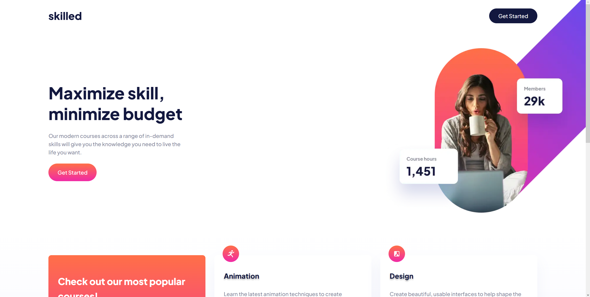

# Frontend Mentor - Skilled e-learning landing page solution

This is a solution to the [Skilled e-learning landing page challenge on Frontend Mentor](https://www.frontendmentor.io/challenges/skilled-elearning-landing-page-S1ObDrZ8q).

## Table of contents

- [Overview](#overview)
  - [The challenge](#the-challenge)
  - [Screenshot](#screenshot)
  - [Links](#links)
- [My process](#my-process)
  - [Built with](#built-with)
  - [Useful resources](#useful-resources)
- [Author](#author)

## Overview

### The challenge

Users should be able to:

- View the optimal layout depending on their device's screen size
- See hover states for interactive elements

### Screenshot

#### The challenge

#### The result

### Links

- Solution URL: [https://github.com/joaskr/skilled-e-learning-landing-page](https://github.com/joaskr/skilled-e-learning-landing-page)
- Live Site URL: [https://skilled-e-learning-landing-page-jade-xi.vercel.app](https://skilled-e-learning-landing-page-jade-xi.vercel.app)

## My process

### Built with

- Semantic HTML5 markup
- CSS
- Flexbox
- CSS Grid
- Mobile-first workflow

### Useful resources

- [A Complete guide to CSS grid](https://css-tricks.com/snippets/css/complete-guide-grid/) - A comprehensive guide to CSS grid, focusing on all the settings both for the grid parent container and the grid child elements.

## Author

- Frontend Mentor - [@joaskr](https://www.frontendmentor.io/profile/joaskr)
- Github - [@joaskr](https://github.com/joaskr)

